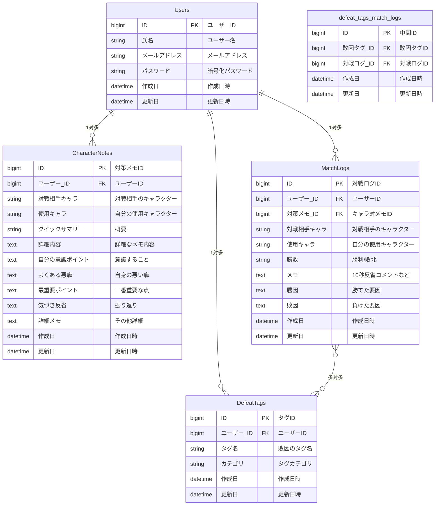
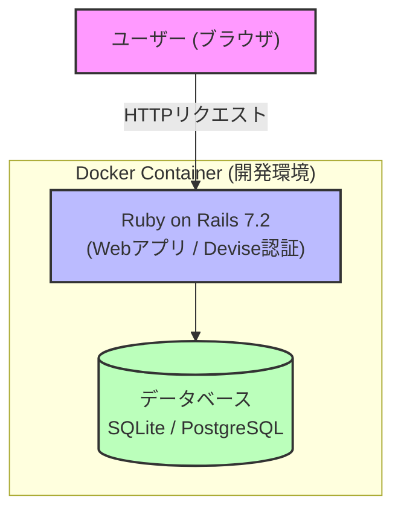

# 🥋 SF6 Practice Notebook（スト6対戦反省・キャラ対策ノート）

ストリートファイター6（SF6）の対戦データを素早く記録し、自分の敗因傾向やキャラクター別の対策を効率的に管理・分析するためのWebアプリケーションです。

## 🌐 サービスURL
- [https://あなたのRenderのURL](https://あなたのRenderのURL)
  ※ゲストログイン機能を用意しているため、登録なしですぐにお試しいただけます。

---

## 🖼️ アプリケーションのイメージ

---

## 📋 機能一覧

| ログイン画面 | トップ画面 |
| :---: | :---: |
|  登録せずにサービスをお試しいただけるゲストログイン機能などを実装しています。 |  アプリのコンセプトや概要をひと目で伝えるトップ画面です。 |
| **1. 10秒反省機能（入力フォーム）** | **2. 10秒反省の敗因タグ機能** |
|  対戦直後に素早く試合結果や反省を記録するための10秒反省機能です。 |  敗因に対してタグを付与・選択することで、自身の弱点を分類できます。 |
| **3. 対戦ログ** | **4. 新規メモによるキャラ対策ページ** |
|  登録した対戦履歴を一覧で確認し、日々の戦績の推移を把握できます。 |  対戦相手のキャラクターごとに、新しい対策メモを作成・蓄積できます。 |
| **5. 作成したものが見れる詳細画面** | **6. 詳細を開くと自分の敗因分析が見れる** |
|  登録した対戦ログや対策メモの内容を個別で確認できる詳細画面です。 |  詳細画面を開くことで、自身の敗因の傾向や詳しい分析結果を確認できます。 |
| **7. 反省、対策メモを検索してみる機能** | |
|  キャラクター名やキーワードをもとに、過去の反省や対策メモを素早く検索・絞り込みできる機能を実装しました。 | |

---

## 🛠️ 使用技術 (Tech Stack)

| カテゴリ | 技術・ツール名 |
| :--- | :--- |
| **バックエンド** | Ruby, Ruby on Rails (Ver. 7.2) |
| **フロントエンド** | HTML, CSS, JavaScript |
| **データベース** | PostgreSQL / SQLite |
| **認証機能** | Devise (ユーザー管理) |
| **インフラ・環境構築** | Docker, Dockerfile |
| **開発環境** | WSL (Ubuntu), VSCode |
| **バージョン管理** | Git, GitHub |

---

## 📊 ER図（データベース設計）

---

## 🏗️ システム構成図

---

graph TD
    %% ユーザー・外部
    Client["Client / Developer (ブラウザ / VSCode)"] -->|HTTPSリクエスト| Internet((インターネット))

    %% デプロイ・CI/CD
    subgraph CICD ["GitHub / CI/CD"]
        GitHub["GitHub Repository (ソースコード管理)"]
        Actions["GitHub Actions (自動テスト・ビルド)"]
    end

    Client -.->|Push & Merge| GitHub
    GitHub -.->|Trigger| Actions

    %% 本番インフラ (Railway / Cloud)
    subgraph Production ["Railway Cloud (本番環境)"]
        subgraph PublicNetwork ["Public Network"]
            LB["Railway Proxy / Load Balancer (HTTPS終端)"]
        end

        subgraph PrivateNetwork ["Private Network (Secure)"]
            subgraph AppContainer [Docker Container]
                Rails["Ruby on Rails 7.2 (Webアプリ / Puma)"]
            end

            subgraph DBContainer [Database]
                PG[(PostgreSQL 本番データベース)]
            end
        end

        LB -->|リクエスト転送| Rails
        Rails -->|データ保存・取得| PG
    end

    Internet -->|アクセス| LB

    %% 監視ツール
    subgraph Monitoring ["Monitoring & Error Tracking"]
        Uptime["UptimeRobot (死活監視)"]
        Sentry["Sentry (エラー監視)"]
    end

    Uptime -.->|HTTPチェック| LB
    Rails -.->|エラー通知| Sentry

    %% スタイリング
    style Client fill:#f9f,stroke:#333,stroke-width:2px
    style Rails fill:#bbf,stroke:#333,stroke-width:2px
    style PG fill:#bfb,stroke:#333,stroke-width:2px
    style LB fill:#fbb,stroke:#333,stroke-width:2px
